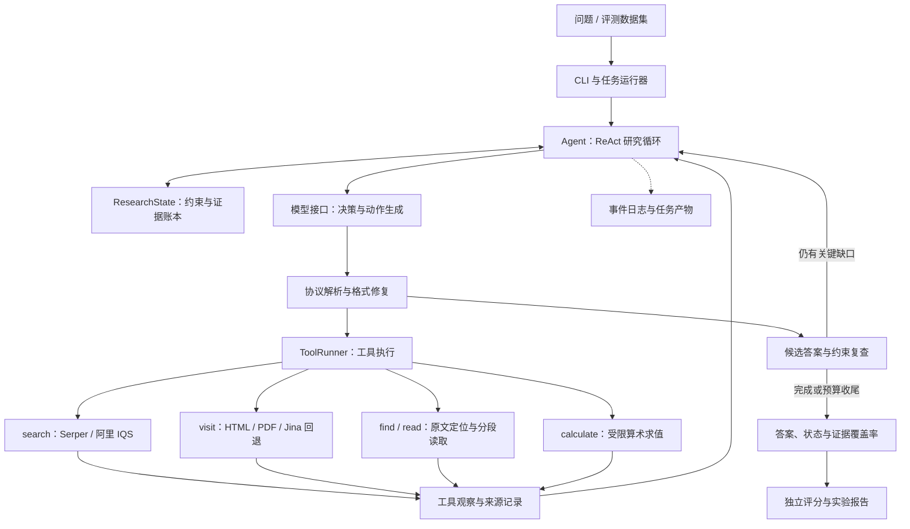

# DeepResearch Agent 面向多跳问答的证据驱动研究智能体

> 阿里云 Data+AI 工程师全球大奖赛（高校赛道）Research Agent 参赛方向的项目整理与工程化实践。
>
> 基于开源竞赛方案的 ReAct 范式，围绕证据约束、长链路检索、异常恢复和可复现评测构建的 Python 研究框架。

DeepResearch Agent 用于回答需要多轮搜索、原文核验、跨来源推理与数值计算的复杂问题。系统将一次研究组织为 **问题约束 → 检索与阅读 → 证据核验 → 缺口复查 → 答案输出** 的闭环，保留每轮决策摘要、工具调用、引用原文和评测结果，便于定位漏掉条件、证据不足或过早作答等问题。


## 演示视频


https://github.com/user-attachments/assets/ad68d91c-ae31-43c2-948b-8f247e2b0fc8

## 基本架构


## 技术框架

采用 Python + asyncio 实现，核心控制流由 `Agent` 显式管理，通过 OpenAI 兼容的 Chat Completions 接口接入模型。当前提供命令行问答、批量评测和轨迹检查入口。



| 层次 | 核心模块 | 职责 |
| --- | --- | --- |
| 执行入口 | `__main__.py`、`runner.py` | 配置检查、单题问答、批量运行、断点续跑 |
| 研究控制 | `agent.py` | ReAct 循环、答案审查、停滞检测、上下文压缩与预算收尾 |
| 研究状态 | `research_state.py` | 问题约束、证据引用、冲突与未解决项 |
| 动作协议 | `contracts.py` | 调用解析、格式修复、答案归一化 |
| 工具执行 | `tools.py` | 搜索、网页/PDF 阅读、原文定位、计算、缓存与并发控制 |
| 模型通信 | `llm.py` | API 调用、超时重试、用量统计 |
| 评测与观测 | `evaluation.py`、`trace.py`、`report.py` | 独立判分、事件记录、汇总指标与报告 |

## 核心设计

### 1. ReAct 循环与有界执行

模型每轮输出简短的 `<decision>` 决策摘要，并选择一个 `<tool_call>` 或 `<answer>`。控制器解析动作、执行工具，再将观察结果送入下一轮。搜索和访问支持数组参数，可并发处理相互独立的查询与 URL。

研究过程同时受轮数、总时间、搜索次数、访问页数与并发数约束。默认最多执行 30 轮、运行 600 秒，并预留 45 秒用于收尾。连续缺少新证据时提示调整来源、语言或候选；达到停止条件后基于已有证据收尾，返回 `best_effort` 或 `no_answer` 等状态，保留停止原因。

### 2. 将问题条件绑定到原文证据

`ResearchState` 维护小型约束账本，每项记录题目原文片段、需要确认的事实、当前发现、状态和证据引用。状态分为 `open`、`supported`、`conflicting`，用于跟踪时间范围、排除条件、实体关系、计数口径等容易遗漏的限制。

证据以“已下载 URL + 原文引句”或字符区间表示。运行时检查引句是否确实出现在下载文本中，保存定位信息；未通过校验的引用不能直接支撑已解决状态。后续更新保留原始问题锚点，减少研究过程中改写题意的风险。

原文匹配验证的是引用存在性，语义支持关系仍由模型审查。最终结果同时返回 `constraint_coverage` 和 `evidence_complete`，便于识别已有答案但仍有条件未核实的情况。

### 3. 搜索、深读与计算分工

| 工具 | 实现与用途 |
| --- | --- |
| `search` | 按配置选择 Serper 或阿里 IQS，批量查询并统一结果格式，发现候选来源 |
| `visit` | 获取公开页面，解析 HTML 或文本型 PDF；直接获取失败时可通过 Jina 回退，可选启用目标导向摘要 |
| `find` | 在已下载全文中查找字面关键词，返回字符位置，定位深层证据 |
| `read` | 按字符区间继续读取已下载全文，避免只依赖首段摘要，不重复发起网络请求 |
| `calculate` | 基于受限 AST 执行算术表达式，记录计算结果，辅助数值题核验 |

网页处理保留带名称的链接索引，模型可根据章节标题找到实际 URL，再继续访问。完整下载文本保存在任务内存中供定位和引用核验使用；模型上下文接收受长度限制的工具结果。

### 4. 答案复查与研究停滞检测

首次提出候选答案后，控制器触发约束审查，要求重新检查问题中的范围、排除项和证据缺口。约束长期没有推进时，系统再次组织缺口复查，引导搜索最有区分度的缺失事实，减少重复收集支持同一候选的页面。

复查有次数上限，无法解决的条件继续保持开放状态。系统通过返回状态和覆盖信息表达研究结果。

### 5. 长链路可靠性

- **协议恢复**：先尝试本地容错解析；无法修复时在有限次数内要求模型重生成，记录原始输出与错误原因。
- **接口恢复**：区分可重试与不可重试错误，设置请求级重试和任务级恢复预算，保留已有消息与证据。
- **上下文压缩**：超过字符预算后保留问题、当前候选、约束账本、近期证据、计算结果与最近消息。
- **任务隔离**：每题单独创建 Agent、工具状态与轨迹目录，避免跨题污染。
- **可观测性**：记录工具调用、页面读取、协议错误、用量、收尾原因和状态变化；日志写入时脱敏已配置密钥。

## 评测与复现

运行器接收 CSV 或 JSONL，Agent 只读取问题；标准答案交给独立评分阶段。评分先做精确匹配，再按需使用 xbench 的 LLM-as-judge 提示词。Judge 异常保留为未评分状态，所有选定题目完成评分后才输出完整准确率，失败题保留在分母中。

每次批量实验记录代码哈希、数据集哈希、题目集合、配置及运行模式。续跑前校验实验签名，跳过已有结果，防止改变模型、数据或代码后混用结果。报告汇总完成状态、判分、Token 用量、搜索调用、延迟及可选费用估算。

Mock 模式用于验证执行链路，不代表真实检索能力或竞赛成绩。当前 README 不声明未经本版本完整评测验证的准确率。

## 快速开始

建议使用 Python 3.11+。以下为 Windows PowerShell 示例：

```powershell
git clone https://github.com/puresunnn/DeepResearch-Agent.git
cd DeepResearch-Agent
python -m venv .venv
.\.venv\Scripts\python.exe -m pip install -r requirements.txt
Copy-Item .env.example .env
```

编辑 `.env`，填写模型网关与搜索服务配置。模型名使用所选网关实际提供的标识；主模型、摘要模型与评分模型可以分别配置。

```dotenv
NEWAPI_BASE_URL=https://your-model-gateway.example/v1
NEWAPI_API_KEY=your-model-api-key
AGENT_MODEL=your-agent-model
SEARCH_PROVIDER=serper
SERPER_API_KEY=your-serper-api-key
```

检查配置并执行单题问答：

```powershell
.\.venv\Scripts\python.exe -m research_baseline check
.\.venv\Scripts\python.exe -m research_baseline ask "2024年图灵奖由谁获得？请核对官方来源。"
```

`check` 只做本地配置检查；追加 `--live` 会请求模型列表并发送一次最小模型调用。无需真实服务即可验证 Mock 链路：

```powershell
.\.venv\Scripts\python.exe -m research_baseline ask "What is the capital of France?" --mock
.\.venv\Scripts\python.exe -m pytest tests -q
```

### 批量评测

准备自己的数据文件，例如 `data/questions.jsonl`，每行包含唯一 `id`、`question` 和参考 `answer`：

```json
{"id":"demo-001","question":"What is the capital of France?","answer":"Paris"}
```

```powershell
# 评分前需配置 JUDGE_MODEL
.\.venv\Scripts\python.exe -m research_baseline smoke --dataset data/questions.jsonl --judge

# 从已有批次恢复，参数与原实验保持一致
.\.venv\Scripts\python.exe -m research_baseline smoke --dataset data/questions.jsonl --judge --resume runs/<run-id>

# 路径使用实际生成的任务目录
.\.venv\Scripts\python.exe -m research_baseline inspect runs/<run-id>/<task-dir>
```

CSV 支持 `prompt` 或 `question` 列，以及 `answer`、可选的 `id` 和 `type` 列。仓库不包含评测数据，独立克隆后应显式传入 `--dataset`；代码中的默认路径指向开发工作区相邻的 `xbench-evals` 目录。

### 关键配置

| 配置 | 默认值 | 用途 |
| --- | --- | --- |
| `SEARCH_PROVIDER` | `serper` | 选择 `serper` 或 `iqs` 搜索后端 |
| `MAX_ROUNDS` | `30` | 研究循环上限 |
| `TASK_TIMEOUT_SECONDS` | `600` | 单题时间预算 |
| `FINAL_RESERVE_SECONDS` | `45` | 答案收尾预留时间 |
| `MAX_SEARCH_QUERIES` / `MAX_VISIT_PAGES` | `30` / `15` | 搜索与页面访问预算 |
| `MAX_TOOL_CONCURRENCY` | `3` | 单次工具批量执行的并发上限 |
| `MAX_CONTEXT_CHARS` | `100000` | 触发上下文压缩的字符阈值 |
| `EXTRACTOR_ENABLED` | `false` | 是否启用额外网页摘要模型 |
| `JINA_API_KEY` | 空 | 可选的网页读取回退服务凭据 |
| `RESEARCH_AS_OF` | 空 | 显式设置历史研究时间锚点 |

完整配置见 [`.env.example`](.env.example)。模型、搜索和可选网页读取服务分别配置凭据。

## 代码与运行产物

```text
research_baseline/
├── __main__.py          # CLI：check / ask / smoke / inspect
├── agent.py             # ReAct 循环与复查、收尾策略
├── research_state.py    # 约束账本与原文引用核验
├── contracts.py         # 动作协议与答案格式
├── tools.py             # 搜索、访问、定位、计算
├── llm.py               # 模型通信与错误恢复
├── runner.py            # 任务隔离、批量运行与续跑
├── evaluation.py        # 数据加载、判分与哈希
├── trace.py             # 事件记录与脱敏
├── report.py            # 实验报告生成
├── config.py            # 环境变量配置与校验
├── mock.py              # 确定性 HTTP 测试替身
└── vendor/              # 复用代码、来源清单与许可证
tests/                   # 协议、工具、可靠性与研究状态测试
scripts/                 # 来源校验及研究行为验证脚本
```

任务产物写入 `runs/`，包括逐题 `events.jsonl`、`messages.json`、`evidence.json`、`research_state.json` 和 `result.json`；批量运行额外生成 `manifest.json`、`results.jsonl`、`summary.json` 与 `REPORT.md`。`.env`、虚拟环境和运行产物由 `.gitignore` 排除。


